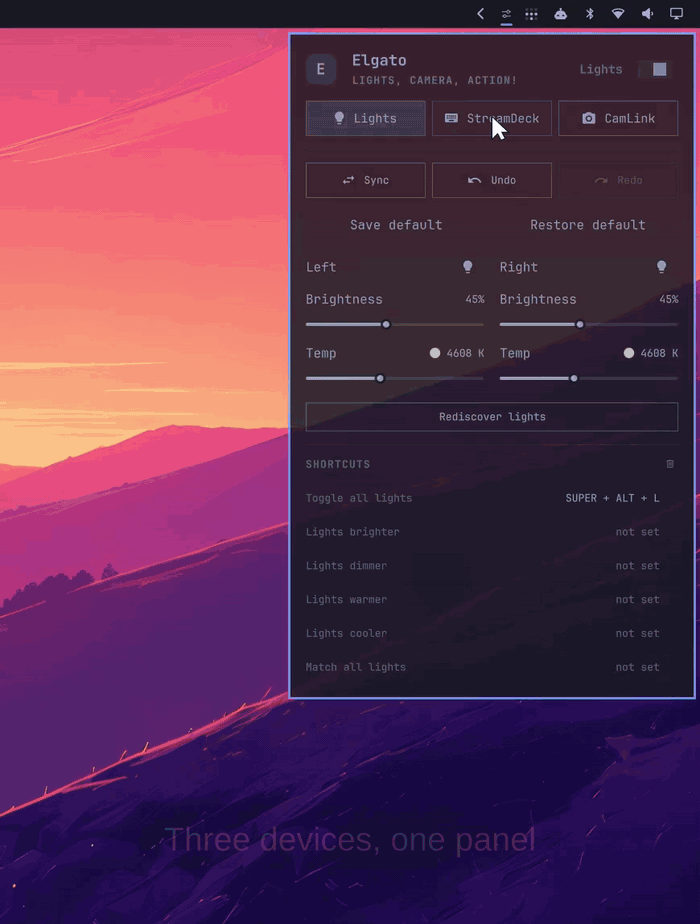
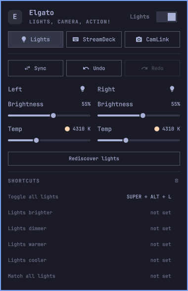
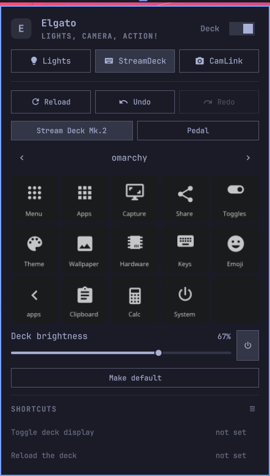
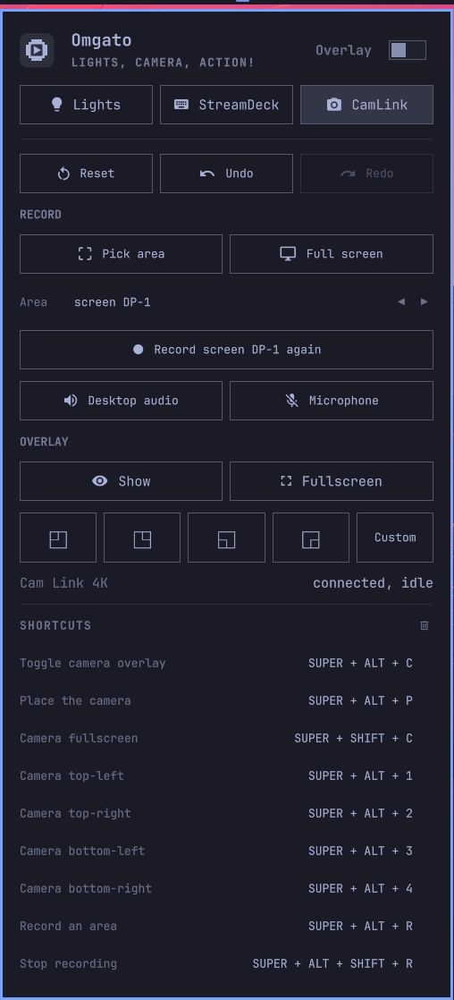

# Omarchy Elgato

[](https://github.com/data-goblin/omarchy-elgato/releases)
[](LICENSE)
[](https://omarchy.org)

An unofficial Omarchy plugin for controlling Elgato hardware like lights,
stream deck and CamLink.

<p align="center">
  
</p>

<p align="center"><a href="docs/images/demo.mp4">Watch the same demo as video</a></p>

<p align="center">
  
  
  
</p>

> [!NOTE]
> I am not a programmer. I used Claude Code and Codex to build this for myself.
> Excuse my ignorance to etiquette or common practice here. Any feedback and contributions welcome!

## Supported hardware

Legend: `✓` yes, `✗` no, `?` plausible but unconfirmed. 

I could only test hardware that I own.

> [!NOTE]
> If you own hardware that is not supported, please feel free to test, add it,
> and submit a PR.

### Stream Deck

Layout comes from the `elgato-streamdeck` crate, so every model it recognises is
laid out correctly with no change here. All are USB vendor `0fd9`.

| Device | Grid | USB ID | Supported | Tested | What the plugin does with it |
| --- | :---: | :---: | :---: | :---: | --- |
| Stream Deck MK.2 | 5x3 | `0080` | ✓ | ✓ | Key grid, pages, multi-key editing, brightness, display power |
| Stream Deck | 5x3 | `0060` | ✓ | ✗ | Same grid and paging as the MK.2 |
| Stream Deck V2 | 5x3 | `006d` | ✓ | ✗ | Same grid and paging as the MK.2 |
| Stream Deck Scissor Keys | 5x3 | `00a5` | ✓ | ✗ | Same as the MK.2; only the key switches differ |
| Stream Deck Mini | 3x2 | `0063` | ✓ | ✗ | Three by two grid, paging, same editing surface |
| Stream Deck Mini MK.2 | 3x2 | `0090` | ✓ | ✗ | Three by two grid, paging, same editing surface |
| Stream Deck Mini: Discord Edition | 3x2 | `00b3` | ✓ | ✗ | Driven identically to the Mini |
| Stream Deck XL | 8x4 | `006c` | ✓ | ✗ | Eight by four grid, paging, same editing surface |
| Stream Deck XL V2 | 8x4 | `008f` | ✓ | ✗ | Eight by four grid, paging, same editing surface |
| Stream Deck Neo | 4x2 | `009a` | ✓ | ✗ | Key grid and paging; the two touch keys are not addressable |
| Stream Deck + | 4x2 | `0084` | ✓ | ✗ | Key grid and paging; dials and touch strip are not addressable |
| Stream Deck Pedal | 3 | `0086` | ✓ | ✓ | Tap, hold and double bindings for each of the three pedals |
| Stream Deck Module (6 keys) | 3x2 | `00b8` | ✓ | ✗ | OEM panel-mount module, driven as its desktop equivalent |
| Stream Deck Module (15 keys) | 5x3 | `00b9` | ✓ | ✗ | OEM panel-mount module, driven as its desktop equivalent |
| Stream Deck Module (32 keys) | 8x4 | `00ba` | ✓ | ✗ | OEM panel-mount module, driven as its desktop equivalent |
| Stream Deck + XL | 9x4 | `00c6` | ✗ | ✗ | Not yet in the device library, so nothing here recognises it |
| Stream Deck Studio | 16x2 | `00aa` | ✗ | ✗ | Not in the device library; the rack unit is unrecognised |
| Stream Deck Mobile, Virtual Stream Deck | - | - | ✗ | ✗ | Software, not USB hardware; out of scope |

Auto-pagination puts its arrows at the two ends of the bottom row, which is
sensible on every grid but has only been seen on a 5x3.

### Lights

Discovered over mDNS as `_elg._tcp` and driven over the local `/elgato/lights`
HTTP API on port 9123. The plugin reads and writes `on`, `brightness` and
`temperature`, so temperature-based lights are fully covered and hue-based ones
are not.

| Device | Colour model | Supported | Tested | What the plugin does with it |
| --- | :---: | :---: | :---: | --- |
| Key Light | Temperature | ✓ | ✓ | Power, brightness, temperature, saved default, rename and reorder |
| Key Light Air | Temperature | ✓ | ✓ | Power, brightness, temperature, saved default, rename and reorder |
| Key Light Mini | Temperature | ✓ | ✗ | Same API; discontinued by Elgato, battery level is not read |
| Ring Light | Temperature | ✓ | ✗ | Power, brightness and temperature; discontinued by Elgato |
| Light Strip | Hue | ✓ | ✗ | Power and brightness only; it is hue based, so no colour control |
| Key Light Neo | Temperature | ? | ✗ | Local HTTP API is not confirmed on this model |
| Key Light Air MK.2 | Temperature | ? | ✗ | Local HTTP API is not confirmed on this model |
| Light Strip Pro | Hue, addressable | ? | ✗ | Per-LED addressing does not fit the flat API this plugin speaks |

Three of these are marked `?` because Elgato does not document the local API and
the newer models are absent from every source that lists it. One command settles
it on your own hardware, and the answer is worth an issue either way:

```bash
curl -s http://<light-ip>:9123/elgato/lights
```

### Cameras

`camctl` matches `/dev/v4l/by-id` against a `device_pattern`, so any device the
kernel exposes as a UVC webcam can drive the overlay. You can change it to something else
by editing `~/.config/camctl/config.toml`:

```toml
device_pattern = "Facecam"
```

| Device | Supported | Tested | What the plugin does with it |
| --- | :---: | :---: | --- |
| Cam Link 4K | ✓ | ✓ | Overlay placement by corner or dragged area, plus recording |
| Facecam MK.2 | ✓ | ✗ | UVC 1.5; set `device_pattern` and the overlay works |
| Facecam 4K | ✓ | ✗ | UVC 1.5; set `device_pattern` and the overlay works |
| Facecam Neo | ✓ | ✗ | UVC 1.5; set `device_pattern` and the overlay works |
| Facecam | ✓ | ✗ | UVC; discontinued by Elgato |
| Facecam Pro | ✓ | ✗ | UVC; discontinued by Elgato |
| Cam Link Pro | ✗ | ✗ | PCIe card exposing DirectShow, not UVC; no Linux support |

### Capture cards

These present as video devices too, so the same overlay and recording path
applies where the kernel binds them.

| Device | Supported | Tested | What the plugin does with it |
| --- | :---: | :---: | --- |
| Game Capture HD60 X | ✓ | ✗ | UVC compatible; usable as an overlay source |
| Game Capture 4K X | ✓ | ✗ | UVC; needs the mainline `USB_QUIRK_NO_BOS` fix for full bandwidth |
| Game Capture 4K S | ✓ | ✗ | UVC compliant; usable as an overlay source |
| Video Capture | ✓ | ✗ | Analogue capture bound by `em28xx` or `cx231xx` in mainline |
| Game Capture Neo | ? | ✗ | Plug and play, but UVC is not stated by Elgato |
| Game Capture 4K Pro | ✗ | ✗ | PCIe with a proprietary Windows-only driver |

### Audio

Nothing in this plugin yet supports specific Elgato audio hardware.

| Device | Supported | Tested | Why not |
| --- | :---: | :---: | --- |
| Wave:3, Wave:3 MK.2 | ✗ | ✗ | USB audio class; capture works, hardware controls do not |
| Wave XLR, Wave XLR MK.2, Wave XLR Pro | ✗ | ✗ | Interface controls need a protocol this plugin does not speak |
| Wave Neo | ✗ | ✗ | USB audio class; capture works, hardware controls do not |
| Wave DX | ✗ | ✗ | A passive XLR microphone; there is nothing to control |
| XLR Dock MK.2 | ✗ | ✗ | Attaches to a Stream Deck +, but exposes no controls here |

### Teleprompter

Nothing in this plugin yet supports Elgato teleprompters.

| Device | Supported | Tested | Why not |
| --- | :---: | :---: | --- |
| Prompter | ✗ | ✗ | Presents as an extra USB-C display, not a controllable device |
| Prompter XL | ✗ | ✗ | Presents as an extra USB display, not a controllable device |


## Install

```bash
omarchy plugin add https://github.com/data-goblin/omarchy-elgato --enable
~/.config/omarchy/plugins/io.github.data-goblin.omarchy-elgato/scripts/install
streamdeck-ctl enable
```

`omarchy plugin add` only clones the plugin and places the widget on the right of
the bar. `scripts/install` is what builds the workspace, links the four binaries
onto PATH, installs the systemd user units, links the agent skill, and applies a
starter Stream Deck layout **only if you have no configuration yet**. Pass
`--no-preset` or `--no-skill` to skip either. It prints the one privileged step it
will not take for you: installing the udev rule.

## Update

Omarchy installs plugins as git checkouts and never pulls them, so an update is
two steps. The second one rebuilds the binaries, and skipping it leaves you
running the old ones:

```bash
omarchy plugin update io.github.data-goblin.omarchy-elgato
~/.config/omarchy/plugins/io.github.data-goblin.omarchy-elgato/scripts/install
```

## Remove

Order matters. `scripts/uninstall` uses the binaries to undo their own Hyprland
edits, so run it before the plugin directory goes away:

```bash
~/.config/omarchy/plugins/io.github.data-goblin.omarchy-elgato/scripts/uninstall
omarchy plugin remove io.github.data-goblin.omarchy-elgato
```

What survives on purpose: your Stream Deck and Pedal configuration, your light
names and display order, and the udev rule at
`/etc/udev/rules.d/70-streamdeck-ctl.rules`, which needs root to remove. Pass
`--purge` to `scripts/uninstall` to drop the saved state as well.

## Lights, defaults and undo

Ten changes of undo history are kept, and separately you can pin one arrangement
as the default and come back to it whenever a session has wandered:

```bash
elgato-panel save-default      # remember the lights exactly as they are
elgato-panel restore-default   # put every light back to it
elgato-panel undo              # or step back one change at a time
```

Both are buttons in the Key Lights view. Restore is greyed out until a default
has been saved.

## The camera overlay and the panel

The panel opens over the top-right corner, which is where the camera overlay
usually sits. Rather than hiding it, the panel tells `camctl` the rectangle it
occupies and the overlay slides clear, returning to its own position when the
panel closes. A placement that does not overlap is left exactly where you put
it, and an overlay switched on while the panel is already open still lands clear
of it.

The overlay switch is the toggle in the top right of the Cam Link view.

## Settings

Each section can be switched off, so a rig with only Key Lights shows only Key
Lights. Set them in the widget settings, or from a script:

```bash
omarchy bar set io.github.data-goblin.omarchy-elgato showDeck false --json
```

| Setting | Default | What it controls |
| --- | :---: | --- |
| `showLights` | `true` | Brightness, temperature and per-light control for Key Lights |
| `showDeck` | `true` | Key grid, pages and pedal bindings for a Stream Deck |
| `showCamera` | `true` | Camera overlay placement and quick screen recording |

## Layout

```
manifest.json          plugin manifest, entry point and settings schema
ui/Panel.qml           the bar widget and panel
src/elgatoctl/         Key Lights over their local HTTP API
src/streamdeck-ctl/    Stream Deck and Pedal daemons, rendering, TUI, preset
src/camctl/            Cam Link overlay and status
src/elgato-panel/      status aggregation, names, shortcuts, undo/redo history
src/skill/             the agent skill describing the tools
scripts/install        build, link, install units, link the skill
scripts/install-skill  link only the agent skill
scripts/uninstall      reverse the installer
```

`elgato-panel` is the only crate the panel asks for state. It gathers one JSON
document from the other three tools, keeps local light names and display order,
and owns the undo histories. Device commands go straight from the panel to
`elgatoctl`, `streamdeck-ctl` and `camctl`, so nothing sits between a click and
the hardware.

## Shortcuts

The plugin writes `~/.config/hypr/elgato-bindings.lua` and adds a single guarded
line to your `bindings.lua` to source it. Your own bindings file is never
rewritten, and removing the plugin cannot break your config. Install them from
the panel, or:

```bash
elgato-panel install-shortcuts
elgato-panel set-shortcut --id lights.toggle --keys "SUPER + ALT + L"
elgato-panel uninstall-shortcuts
```

Only a handful are bound out of the box: one for the lights, none for the deck,
and the camera and recording ones. Everything else is listed unbound in the
panel, ready to be given a combination. Shortcuts are listed per section,
rebindable from the panel, and warn you when a combination is already claimed.

## What it installs, and where

Plugins run unsandboxed with your user permissions, so here is everything this
one touches outside its own directory.

```yaml
~/.local/bin/:            symlinks to the four binaries it builds
~/.config/systemd/user/:  streamdeck-ctl.service and streamdeck-ctl-deck.service,
                          the Stream Deck and Pedal daemons
~/.config/hypr/:          elgato-bindings.lua, plus one guarded pcall line added
                          to bindings.lua, only when you install shortcuts
~/.local/state/elgato-panel/: light display names, display order, undo history
~/.cache/elgato-panel/:   rendered key previews
~/.config/streamdeck-ctl/config.toml: your deck and pedal configuration
$XDG_RUNTIME_DIR/camctl/: overlay position and pid, cleared on reboot
agent skill directories:  a symlink to src/skill/, only where the directory
                          already exists, and only if you did not pass --no-skill
```

`scripts/uninstall` reverses all of it. It keeps your device configuration
unless you pass `--purge`.

### Privileges

The plugin never asks for root and contains no sudoers rule. Two things need
privilege and both are left to you, printed as instructions rather than run:

- installing the udev rule that grants access to Stream Deck hardware:

  ```bash
  sudo install -m 0644 \
    ~/.config/omarchy/plugins/io.github.data-goblin.omarchy-elgato/src/streamdeck-ctl/udev/70-streamdeck-ctl.rules \
    /etc/udev/rules.d/70-streamdeck-ctl.rules
  sudo udevadm control --reload-rules && sudo udevadm trigger
  ```

- `camctl reset`, which re-authorizes the Cam Link over USB to clear a wedged
  capture device, and needs passwordless sudo for that one write if you want it

Runtime pid state lives in `$XDG_RUNTIME_DIR/camctl/`, which is owner-only, not
in a shared temporary directory.

### Network and processes

`elgatoctl` talks HTTP to Key Lights on your local network, discovered over mDNS
with `avahi-browse`. Nothing else makes network calls and nothing phones home.
The daemons are ordinary systemd user services; no second Quickshell process is
ever started.

## Requirements

```yaml
Omarchy Quattro:      the Quickshell shell this plugin draws into
Rust 1.89+:           to build the workspace (rust)
avahi-browse:         Key Light discovery over mDNS (avahi)
mpv:                  the Cam Link overlay window (mpv)
pw-dump:              PipeWire state for camera status (pipewire)
gpu-screen-recorder:  screen recording (gpu-screen-recorder)
ffmpeg:               recording post-pass (ffmpeg)
slurp:                region picking for the overlay and recording (slurp)
fonts:                a text font and a Nerd Font for rendering deck keys;
                      fontconfig supplies a stand-in if the configured paths
                      do not exist
systemd --user:       the Stream Deck and Pedal daemons
```

Package names in brackets are the Arch packages that provide each binary.

## Troubleshooting

```yaml
No Stream Deck found:     the udev rule is missing. Install it as shown above,
                          then unplug and replug the device
Keys never update:        the daemons are not running. Check with
                          systemctl --user status streamdeck-ctl-deck
No lights discovered:     run elgatoctl discover. Key Lights answer over mDNS,
                          so the machine must be on the same subnet as the lights
A light reads unreachable: probes retry inside a 500ms budget, so a light that
                          still reports unreachable is genuinely not answering.
                          Confirm with elgatoctl ls --json
Camera overlay is black:  the Cam Link is single-open. If a user service holds
                          it, the overlay borrows the device and gives it back
                          on hide. A plain process is named rather than killed.
                          If it stays wedged, camctl reset
```

## Contributing

Issues and pull requests are welcome, particularly for hardware not marked tested
above. Please run `cargo clippy --release --workspace` and `cargo build --release`
before opening one. Release history is in [CHANGELOG.md](CHANGELOG.md).

## Licence

MIT. See [LICENSE](LICENSE).

Elgato, Stream Deck, Key Light and Cam Link are trademarks of Corsair Gaming and
its Elgato brand, which does not sponsor or endorse this project.

This is an unofficial, community-built plugin and is not affiliated with Elgato.
